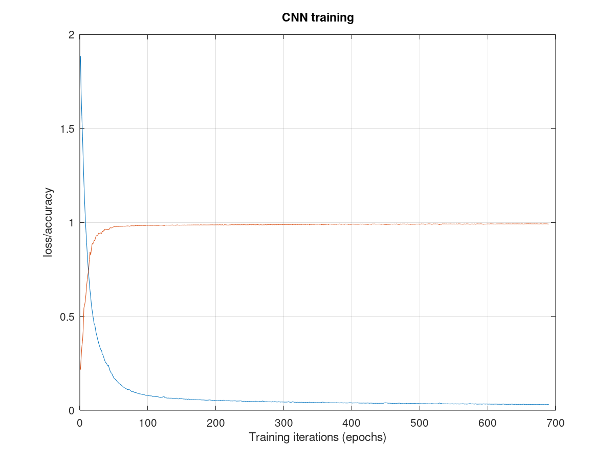

# Convolutional neural network for hyperspectral images classification

## Synopsis

This is implementation of 1D convolutional neural network for hyperspectral images
classification by means of well-known `keras` and `torch` frameworks.

This realization is related to cpp program developed by [eugnsp](https://github.com/eugnsp/cnn_hsi).

The network model is 1D CNN according to [1]:

* Convolutional layer (`tanh`, ~10 filters, kernel size ~20)
* Pooling layer (`max`, pooling size ~5)
* Fully connected layer (`tanh`, ~100 nodes)
* Output layer (`softmax`, ~10 nodes)

So we have the following structure for model1:

Layer (type)                | Output Shape                |             Param     |
:-------------------------- |:--------------------------- |:--------------------- |
conv1d (Conv1D)             | (None, 185, 10)             |             210       |
max_pooling1d (MaxPooling1D)| (None, 37, 10)              |             0         |
flatten (Flatten)           | (None, 370)                 |             0         |
dense (Dense)               | (None, 100)                 |             37100     |
dense_1 (Dense)             | (None, 7)                   |             707       |
Total params: 38,017        |
Trainable params: 38,017    |
Non-trainable params: 0     |
|

There are also keras models with modifications to base:

model2 - dropout;

model3 - kernel regularization.

The same model for torch is implemented.

The gradient descent method was used for learning.

## Data format
The program have `mat` file import capabilities. Data can be scaled to [-1;1] or not.
In case of `txt` files data is considered to be scaled to [-1;1]. 

`txt` file format is set to (nbands, nrows, ncols). Data is written column-wise: Each column have `nbands` 
components representing one pixel. 

Data format for keras is row-wise: each row have `nbands` component representing one pixel.

## How to run

Python 3 enviroment with additional packages `keras`, `pytorch` and `tensorflow` is required to run. 
`logs` subdir should be created for working with `keras` implementation. `output` subdir should be created for both
`keras` and `torch` implementations. 

The program was tested with tensorflow 2.0 to use `keras-tuner` capability.

The following parameters should be specified for `hsi_classifier_keras.py` and `hsi_classifier_torch.py`:

`--tr`, default = "salinas.txt.zip": read train set from FILE, `required`

`--trlabels`, default = "salinas_labels.txt.zip": read train labels from FILE, `required`

`--te`: read test set from FILE

`--telabels`: read test labels from FILE

`-m`, `--model`: read model with NN weights from FILE 

`--tuner`: activate tuner mode 

`--nosplit`: use only train set without test (the same set for train and test)

## Results

Hyperspectral data from [2] (Salinas-A scene) was training and testing the network. Data is preprocessed by the following way. Class  labels were changed: 10->2, 11->3, 12->4, 13->5, 14->6. Columns were permuted to [3 1 2]. Pixel values were scaled to [-1;1] uniformly. The image below shows the example of classification results after the specified number of training iterations.

## References

1. Wei Hu et al. *Deep convolutional neural networks for hyperspectral image
classification*.\
[J. Sensors **2015**, article ID 258619 (2015)](https://doi.org/10.1155/2015/258619).
2. [Hyperspectral remote sensing scenes](http://www.ehu.eus/ccwintco/index.php?title=Hyperspectral_Remote_Sensing_Scenes).

## License

This code is distributed under GNU General Public License v3.0.
